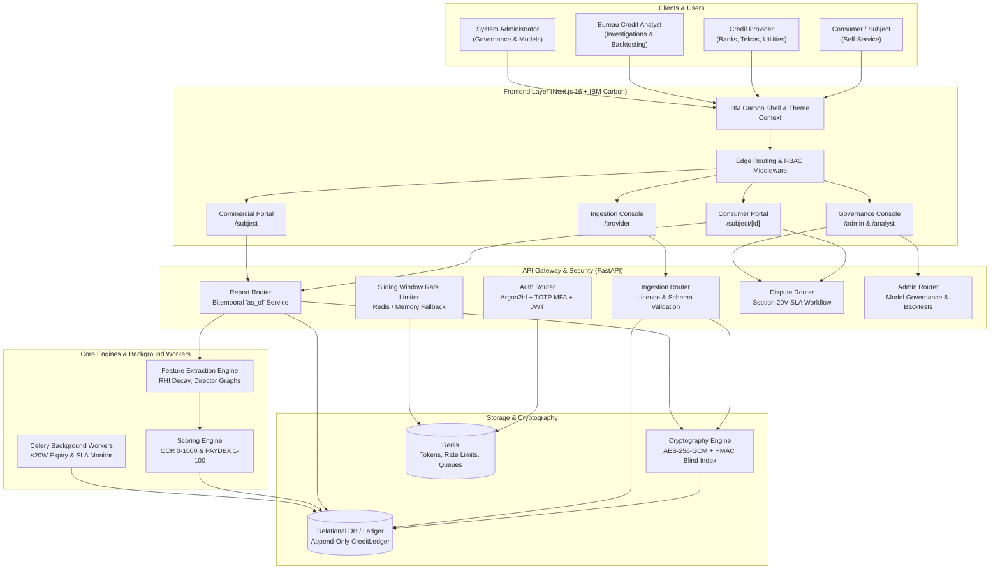

# System Architecture & Bitemporal Ledger Design

## 1. Architectural Overview

The Credit Reporting Mechanism (CRMS) is an institutional-grade Comprehensive Credit Reporting (CCR) platform built to satisfy the statutory mandates of the **Privacy Act 1988 (Cth) Part IIIA**, the **Privacy (Credit Reporting) Code 2014 (CR Code)**, and the **National Consumer Credit Protection Act 2009 (NCCPA)**.

The system is architecturally decoupled into six core layers:
1. **Presentation Layer**: Next.js 16 App Router application styled with the IBM Carbon Design System (`@carbon/react`), implementing WCAG 2.1 AA compliant interfaces for Consumers, Credit Providers, Bureau Analysts, and System Administrators.
2. **Edge Security & Routing Layer**: Next.js Edge Middleware verifying session tokens and executing role-based access control (RBAC) route guarding.
3. **API & Orchestration Layer**: FastAPI (Python 3.11) asynchronous application providing RESTful endpoints, request validation schemas, rate limiting, and Sentry/Prometheus observability.
4. **Data Privacy & Cryptographic Layer**: Field-level encryption (AES-256-GCM) protecting Personally Identifiable Information (PII) at rest, combined with deterministic HMAC-SHA256 blind indexing for query resolution without decryption.
5. **Bitemporal Ledger Layer**: Append-only relational event ledger tracking both **Valid Time** (when a real-world credit event occurred) and **Recorded Time** (when the bureau received and committed the record), ensuring perfect auditability and historical reconstruction.
6. **Analytics & Scoring Engine**: Decoupled deterministic feature extraction and model scoring services calculating individual CCR credit scores (0–1000) and commercial corporate PAYDEX ratings (1–100).

---

## 2. End-to-End Data Flow

### Ingestion to Ledger to Score to Report

1. **Credit Event Transmission**: A licensed credit provider (e.g. an ADI bank) posts a credit event (such as a 24-month Repayment History Information update or a statutory default notice) to `/api/ingest/record` or via bulk `/api/ingest/csv`.
2. **Provider Licensing & Permissible Purpose Verification**:
   - The provider's active tenancy and licence category (`ADI`, `ACL`, `TELCO`, `UTILITY`) are checked against `models.Provider.permitted_data_types`.
   - *Example*: Under Privacy Act Section 20N, only licensed ADIs and ACL credit providers may submit Repayment History Information (RHI). Telcos and utilities attempting to submit RHI are rejected with HTTP 403.
3. **Statutory Schema Validation**:
   - Pydantic models (`schemas.IngestRecordRequest`) enforce legal rules:
     - Defaults must have an overdue amount $\ge \$150$ and be overdue for $\ge 60$ days (Section 6Q(1)).
     - Statutory Section 6Q and Section 21D notices must be marked as served.
     - RHI strings must conform strictly to the 24-character CCR regex (`^[0-6XACV]{1,24}$`).
4. **Append-Only Ledger Commitment**:
   - An immutable row is inserted into `credit_ledger` with `status = ACTIVE`, capturing:
     - `valid_from`: When the payment was missed or account opened in the real world.
     - `recorded_at`: The cryptographic timestamp when the bureau accepted the event.
   - PII fields (first name, last name, identifier) are encrypted using AES-256-GCM, and an HMAC-SHA256 blind index is calculated for O(1) indexed lookups.
5. **Feature Store Extraction**:
   - `services.features.calculate_individual_features()` evaluates:
     - 24-month RHI history with exponential time decay ($w_t = 0.95^t$), penalizing recent delinquencies higher than older ones.
     - Hardship Neutrality (Section 20V): Financial hardship flags (`A` for temporary variance, `V` for permanent variation) are treated neutrally and never penalized.
     - Revolving credit utilization ratio ($0.0 \dots 1.0$).
     - Default debt severity, bankruptcy occurrences, and hard credit enquiries.
6. **Deterministic Scoring Engine**:
   - `services.scoring.evaluate_individual_score()` applies the active model's normalized weights (summing to exactly 100%):
     $$\text{Raw Score} = w_{\text{rhi}} S_{\text{rhi}} + w_{\text{util}} S_{\text{util}} + w_{\text{history}} S_{\text{hist}} + w_{\text{defaults}} S_{\text{def}} + w_{\text{inquiries}} S_{\text{inq}}$$
   - Point deductions for active adverse listings are applied.
   - Thin-file rule: Files with $< 3$ months of credit history are strictly capped at 499 points ("Poor" band).
7. **Report Assembly & Mandatory Audit Logging**:
   - When a subscriber or analyst queries `/api/reports/{id}`, the bureau automatically generates an immutable `Enquiry` record. Under Privacy Act Section 20R, every access to a consumer's credit file must be visible to the consumer on their report.

---

## 3. The Bitemporal Ledger Explained

Traditional databases maintain a single timestamp column (e.g. `created_at` or `updated_at`). In a credit reporting bureau, this creates severe regulatory compliance failures:
- If a bank corrects an erroneous default listed 6 months ago, overwriting the record destroys the evidence of what score a loan officer saw 3 months ago when evaluating a mortgage application.
- Under Privacy Act Section 20U and dispute resolution cases, the bureau must be able to prove the exact state of a credit file at any past point in time.

To solve this, CRMS implements a **Bitemporal Ledger Model** (`models.CreditLedger`):

| Temporal Dimension | Database Column | Definition | Can it change? |
| :--- | :--- | :--- | :--- |
| **Valid Time** (*State Time*) | `valid_from` / `valid_to` | The real-world timeframe during which the credit fact is true. | Represents business reality. |
| **Recorded Time** (*Transaction Time*) | `recorded_at` / `superseded_at` | The bureau timestamp when this record was committed into the database. | Strictly immutable (append-only). |

### Bitemporal Worked Example

#### Scenario: Retroactive Correction of an Erroneous Default Listing

- **2026-01-10**: Consumer Jonathan Vance misses a payment.
- **2026-03-15**: Bank A reports a $500 default occurring on 2026-01-10. The bureau writes Record 1:
  - `id`: `REC-001`
  - `valid_from`: `2026-01-10`
  - `valid_to`: `NULL` (ongoing)
  - `recorded_at`: `2026-03-15 10:00:00`
  - `superseded_at`: `NULL`
  - `status`: `ACTIVE`
  - `amount`: `500.00`
- **2026-04-01**: Bank B pulls Jonathan's credit report to assess a car loan.
  - Query executed: `as_of = 2026-04-01`
  - Filter: `recorded_at <= '2026-04-01' AND (superseded_at IS NULL OR superseded_at > '2026-04-01')`
  - Result: `REC-001` is returned. Jonathan has an active default. Loan is priced higher.
- **2026-05-20**: Jonathan files a Section 20V dispute. Bank A admits the default was a bank billing processing error and issues a correction.
  - The bureau does **NOT** update or delete `REC-001`.
  - Instead, the bureau issues two atomic ledger operations:
    1. Update `REC-001`: Set `superseded_at = '2026-05-20 14:30:00'`, `status = SUPERSEDED`.
    2. Insert `REC-002`:
       - `id`: `REC-002`
       - `valid_from`: `2026-01-10`
       - `valid_to`: `2026-01-10` (corrected as zero duration)
       - `recorded_at`: `2026-05-20 14:30:00`
       - `superseded_at`: `NULL`
       - `status`: `RESOLVED` (or expunged)
       - `notes`: "Adjudicated under Section 20V - bank administrative error"

#### The Bitemporal Query Invariant:
- If an auditor queries: *"What was Jonathan's file as known on 2026-04-01?"*
  - The query sets `as_of = 2026-04-01`.
  - It returns `REC-001` (Default present). This confirms why Bank B priced the loan that way on April 1st.
- If an auditor queries: *"What is Jonathan's file today (2026-06-01)?"*
  - It filters against `recorded_at <= '2026-06-01' AND superseded_at IS NULL`.
  - `REC-001` is filtered out because `superseded_at ('2026-05-20') <= '2026-06-01'`.
  - Only `REC-002` (or no default) is returned. Jonathan's current score is clean.
