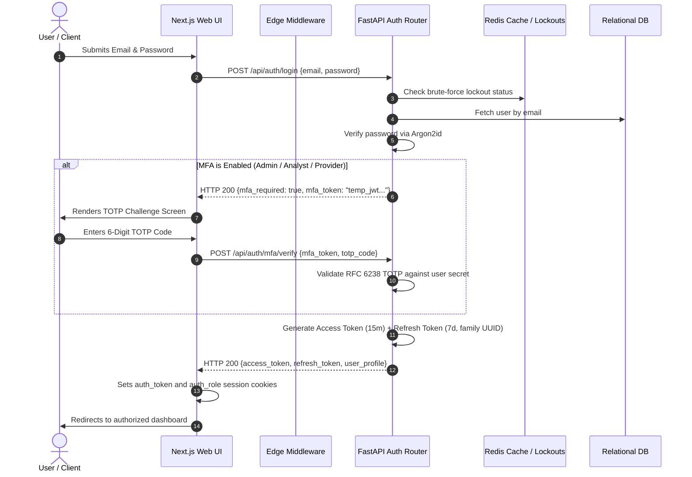

# Security Architecture & Cryptographic Controls

## 1. Overview

The Security Architecture of the Credit Reporting Mechanism (CRMS) enforces stringent confidentiality, integrity, and availability controls aligned with:
- **Nepal Individual Privacy Act 2018 (वैयक्तिक गोपनीयता सम्बन्धी ऐन, २०७५)**: Legal mandate requiring robust technical and organizational measures to safeguard personal and financial records against unauthorized access, loss, or manipulation.
- **Nepal Rastra Bank (NRB) IT Guidelines & Cyber Security Directives**: Information security, multi-factor authentication, cryptographic isolation, and auditability requirements for licensed financial institutions and credit reference bureaus.
- **NIST SP 800-63B Digital Identity Guidelines**: Robust session authentication and Authenticator Assurance Level 2 (AAL2) multi-factor standards.

---

## 2. Authentication & Session Security Flow

*Code Reference*: [`backend/app/auth.py`](file:///c:/Users/Saurav(Interlace)/OneDrive%20-%20INTERLACE%20STUDIES%20PTY%20LTD/Desktop/credit%20system/backend/app/auth.py) and [`backend/app/routers/auth_router.py`](file:///c:/Users/Saurav(Interlace)/OneDrive%20-%20INTERLACE%20STUDIES%20PTY%20LTD/Desktop/credit%20system/backend/app/routers/auth_router.py)

### 2.1 Password Hashing (Argon2id)
- Passwords are encrypted using **Argon2id** (memory-hard winner of the Password Hashing Competition):
  - Time cost: 3 iterations
  - Memory cost: 65,536 KB (64 MB)
  - Parallelism: 4 threads
- Mitigates GPU/ASIC offline dictionary cracking.

### 2.2 Multi-Factor Authentication (MFA)
- Implements **RFC 6238 Time-based One-Time Passwords (TOTP)** using 160-bit Base32 shared secrets.
- Required for all privileged personas: `ADMIN`, `ANALYST`, and `PROVIDER`.
- Standard consumers (`SUBJECT`) may opt in or use single-factor credentials.

### 2.3 Refresh Token Rotation (RTR) & Reuse Detection
- Refresh tokens carry a 7-day lifetime and embed a cryptographically random token identifier (`jti`) and token family ID.
- Reusing an invalidated refresh token triggers automatic family revocation to protect against token compromise.

---

## 3. Cryptographic Storage & Deterministic Blind Indexing

*Code Reference*: [`backend/app/encryption.py`](file:///c:/Users/Saurav(Interlace)/OneDrive%20-%20INTERLACE%20STUDIES%20PTY%20LTD/Desktop/credit%20system/backend/app/encryption.py)

To satisfy data protection requirements under the Nepal Individual Privacy Act 2018:
1. **Primary Identifiers Encryption at Rest**:
   - Nepal Citizenship Numbers (नागरिकता नं.), National IDs (राष्ट्रिय परिचयपत्र), and PANs are encrypted at rest using **AES-256-GCM**.
   - Every encryption operation generates a unique cryptographically random 96-bit Initialization Vector (IV).
2. **Deterministic Blind Indexing**:
   - To allow fast exact-match searches without exposing plaintext identifiers to the database engine, an **HMAC-SHA256 Blind Index** is generated with an isolated secret salt key.
   - Searching by citizenship number or PAN hashes the query through the HMAC function and matches the blind index column directly.
