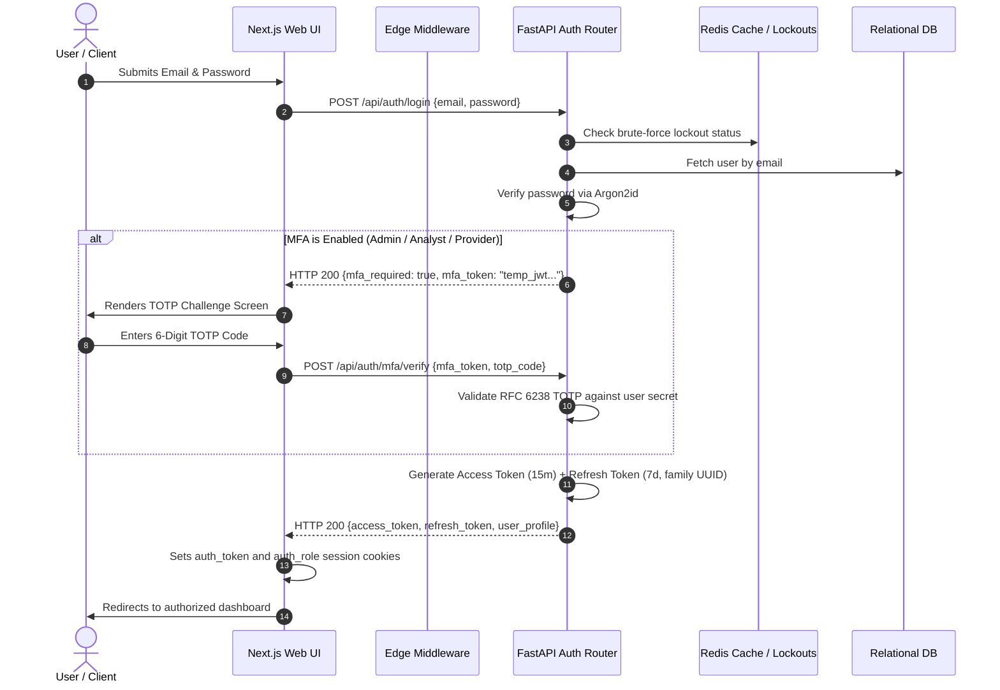

# Security Architecture & Cryptographic Controls

## 1. Overview

The Security Architecture of the Credit Reporting Mechanism (CRMS) enforces stringent confidentiality, integrity, and availability controls aligned with:
- **Australian Privacy Principles (APP 11)**: Reasonable steps to protect personal information from misuse, interference, loss, unauthorized access, modification, or disclosure.
- **APRA Prudential Standard CPS 234 (Information Security)**: Maintaining information security commensurate with the size and vulnerability of credit information assets.
- **NIST SP 800-63B Digital Identity Guidelines**: Robust session authentication and Authenticator Assurance Level 2 (AAL2) multi-factor standards.

---

## 2. Authentication & Session Security Flow

*Code Reference*: [`backend/app/auth.py`](file:///c:/Users/Saurav(Interlace)/OneDrive%20-%20INTERLACE%20STUDIES%20PTY%20LTD/Desktop/credit%20system/backend/app/auth.py) and [`backend/app/routers/auth_router.py`](file:///c:/Users/Saurav(Interlace)/OneDrive%20-%20INTERLACE%20STUDIES%20PTY%20LTD/Desktop/credit%20system/backend/app/routers/auth_router.py)

### 2.1 Password Hashing (Argon2id)
- Passwords are encrypted using **Argon2id** (memory-hard winner of the Password Hashing Competition):
  - Time cost: 3 iterations
  - Memory cost: 65,536 KB (64 MB)
  - Parallelism: 4 threads
- Mitigates GPU/ASIC offline dictionary cracking.

### 2.2 Multi-Factor Authentication (MFA)
- Implements **RFC 6238 Time-based One-Time Passwords (TOTP)** using 160-bit Base32 shared secrets.
- Required for all privileged personas: `ADMIN`, `ANALYST`, and `PROVIDER`.
- Standard consumers (`SUBJECT`) may opt in or use single-factor password flows.

### 2.3 Refresh Token Rotation (RTR) & Reuse Detection
- Refresh tokens carry a 7-day lifetime and embed a cryptographically random token identifier (`jti`) and token family ID.
- When `/api/auth/refresh` is called:
  1. The old refresh token is marked as consumed.
  2. A new access token and fresh refresh token are issued.
  3. **Reuse Detection**: If an already-consumed refresh token is submitted (indicating token theft), the entire token family is immediately revoked, forcing all active sessions for that user to terminate.

### 2.4 Brute-Force Lockout Protection
- Tracks consecutive failed login attempts per email address:
  - 5 consecutive failures triggers an automatic **15-minute account lockout**.
  - Successful authentication resets the counter to 0.

---

## 3. Role-Based Access Control (RBAC) Matrix

*Code Reference*: [`backend/app/routers/`](file:///c:/Users/Saurav(Interlace)/OneDrive%20-%20INTERLACE%20STUDIES%20PTY%20LTD/Desktop/credit%20system/backend/app/routers/)

| Endpoint / Action | Minimum Role | Permitted Roles | Description & Data Isolation Rule |
| :--- | :--- | :--- | :--- |
| `POST /api/auth/login` | PUBLIC | Anyone | Initial credential authentication. |
| `POST /api/auth/mfa/verify` | PUBLIC | Anyone | Validates TOTP token. |
| `GET /api/reports/{id}` | SUBJECT | SUBJECT, ANALYST, ADMIN, PROVIDER | **Data Isolation**: Subjects may ONLY access their own `entity_id`. Accessing another subject returns HTTP 403. |
| `POST /api/ingest/record` | PROVIDER | PROVIDER, ADMIN | Must match provider tenant ID and licensed data types. |
| `POST /api/ingest/csv` | PROVIDER | PROVIDER, ADMIN | Bulk ledger ingestion. |
| `GET /api/disputes` | ANALYST | ANALYST, ADMIN | List all open Section 20V dispute cases. |
| `POST /api/disputes` | SUBJECT | SUBJECT, ANALYST, ADMIN | Lodge a dispute on a specific ledger record. |
| `PUT /api/disputes/{id}` | ANALYST | ANALYST, ADMIN | Adjudicate a dispute (RESOLVED, CORRECTED, REJECTED). |
| `GET /api/admin/models` | ADMIN | ADMIN | Inspect active scoring model versions. |
| `POST /api/admin/models` | ADMIN | ADMIN | Deploy new model version (weights must sum to 100). |
| `POST /api/admin/models/backtest`| ANALYST | ANALYST, ADMIN | Run statistical backtesting (AUC, Gini, KS). |
| `GET /api/admin/audit-logs` | ADMIN | ADMIN | Inspect immutable system audit trail. |

---

## 4. Cryptographic Controls & Field-Level Encryption

*Code Reference*: [`backend/app/encryption.py`](file:///c:/Users/Saurav(Interlace)/OneDrive%20-%20INTERLACE%20STUDIES%20PTY%20LTD/Desktop/credit%20system/backend/app/encryption.py)

Credit reporting data contains high-value Personally Identifiable Information (names, dates of birth, drivers licence numbers). To prevent bulk database exposure in the event of database backup theft or SQL injection, CRMS uses **Field-Level Encryption (FLE)**.

### 4.1 AES-256-GCM Encryption
- Encrypts PII fields before writing to SQL storage (`models.Entity.identifier`, `models.Entity.basic_info`).
- **Initialization Vector (IV)**: 12-byte cryptographically secure random nonce generated per encryption operation (`os.urandom(12)`).
- **Authentication Tag**: 16-byte GCM tag verifying ciphertext authenticity and protecting against bit-flipping attacks.
- Format stored: `Base64(IV + Ciphertext + Tag)`.

### 4.2 HMAC-SHA256 Blind Indexing
Because AES-256-GCM uses random nonces, the same plaintext produces completely different ciphertexts each time it is encrypted. This makes standard SQL queries (`WHERE identifier = ?`) impossible without decrypting every row in the database.

To solve this efficiently without compromising privacy:
- A separate secret salt (`BLIND_INDEX_SALT`) is held securely in memory.
- A deterministic HMAC-SHA256 hash is computed over the normalized identifier:
  $$\text{Blind Index} = \text{HMAC-SHA256}(\text{Salt}, \text{Normalize}(Identifier))$$
- The database indexes `identifier_blind_index`. Exact match searches run in $O(1)$ time while the raw database never reveals cleartext identifiers.

---

## 5. Sliding-Window Rate Limiting

*Code Reference*: [`backend/app/rate_limiter.py`](file:///c:/Users/Saurav(Interlace)/OneDrive%20-%20INTERLACE%20STUDIES%20PTY%20LTD/Desktop/credit%20system/backend/app/rate_limiter.py)

Protects against distributed denial-of-service (DDoS) and credential stuffing attacks using a Redis sliding-window algorithm (with an automatic in-memory fallback if Redis is unavailable):

| Client Tier | Window Duration | Max Allowed Requests | HTTP Status on Exceeded |
| :--- | :--- | :--- | :--- |
| **Anonymous / Public** | 60 seconds | 60 requests | HTTP 429 Too Many Requests |
| **Authenticated Subject** | 60 seconds | 120 requests | HTTP 429 Too Many Requests |
| **Credit Provider API** | 60 seconds | 300 requests | HTTP 429 Too Many Requests |
| **Bureau Analyst / Admin**| 60 seconds | 600 requests | HTTP 429 Too Many Requests |

---

## 6. Known Security Considerations & Future Hardening

1. **Hardware Security Module (HSM) Key Storage**:
   - *Current*: `ENCRYPTION_KEY` and `BLIND_INDEX_SALT` are read from environment variables.
   - *Future*: Migration to AWS KMS, Azure Key Vault, or HashiCorp Vault with automated envelope encryption.
2. **Cookie Security Attributes**:
   - In production environments, session cookies (`auth_token` and `auth_role`) must be served strictly with `HttpOnly; Secure; SameSite=Strict` flags over TLS 1.3.
3. **Audit Log Cryptographic Chaining**:
   - The bitemporal ledger is append-only at the ORM layer. Future revisions can incorporate cryptographic hash chaining (blockchain / tamper-evident Merkle trees) across ledger blocks to prevent direct database administrator tampering.
